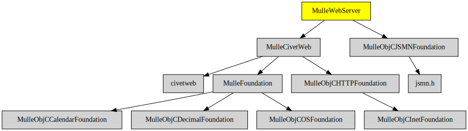

# MulleWebServer

#### 🤽🏻‍♂️ Web Server based on civetweb for mulle-objc

This is a small WebServer library written on top of the MulleFoundation.

It contains an HTTP server and support for JSON. It is experimental at this stage.


### You are here




## About

Serving a NSDictionary to the net can be done like this:


```
//
// define a handler to service web requests, that answers
// http://<host>:8080/foo requests
//
@interface MyWebRequestHandler : NSObject <MulleCivetWebRequestHandler>
@end


@implementation MyWebRequestHandler

- (MulleCivetWebResponse *) webServer:(MulleCivetWebServer *) server
             webResponseForWebRequest:(MulleCivetWebRequest *) request
{
   MulleCivetWebTextResponse   *response;
   NSDictionary                *dictionary;

   if( [[[request URL] path] isEqualToString:@"foo"])
   {
      response   = [MulleCivetWebTextResponse webResponseForWebRequest:request];
      dictionary = @{ @"foo": @"VfL Bochum 1848" };
      [response appendLine:[dictionary mulleJSONDescription]];

      return( response);
   }
   return( nil);
}

@end


int  main( void)
{
   MyWebRequestHandler   *handler;
   MulleCivetWebServer   *server;

   // install request handler in server
   handler = [MyWebRequestHandler object];
   server  = [MulleCivetWebServer object];
   [server setRequestHandler:handler];

   // let server run until CTRL-C or signal
   for(;getchar() != 'q';);

   return( 0);
}
```

> This library ties MulleCivetWebServer to MulleObjCOSFoundation
> to gain logging functionality.


## Add

Use [mulle-sde](//github.com/mulle-sde) to add MulleWebServer to your project:

```
mulle-sde dependency add --objc --github MulleWeb MulleWebServer
```

## Install

Use [mulle-sde](//github.com/mulle-sde) to build and install MulleWebServer and
all its dependencies:

```
mulle-sde install --objc --prefix /usr/local \
   https://github.com/MulleWeb/MulleWebServer/archive/latest.tar.gz
```


## Author

[Nat!](//www.mulle-kybernetik.com/weblog) for
[Mulle kybernetiK](//www.mulle-kybernetik.com) and
[Codeon GmbH](//www.codeon.de)
